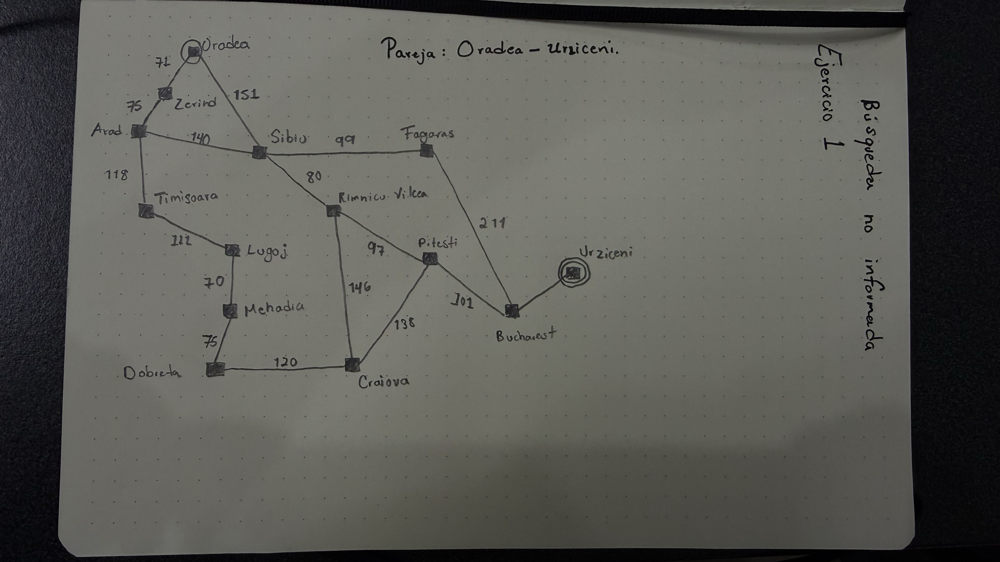
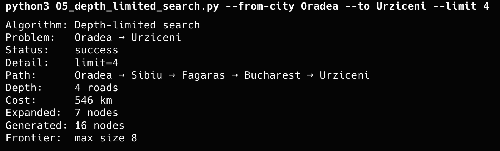
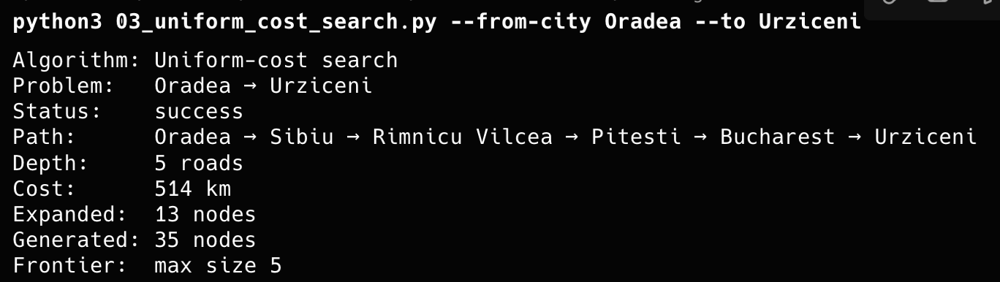
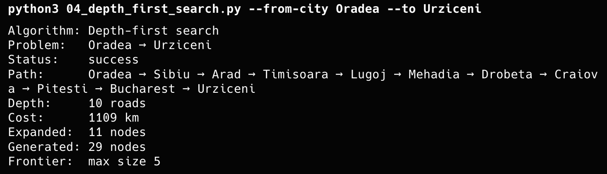
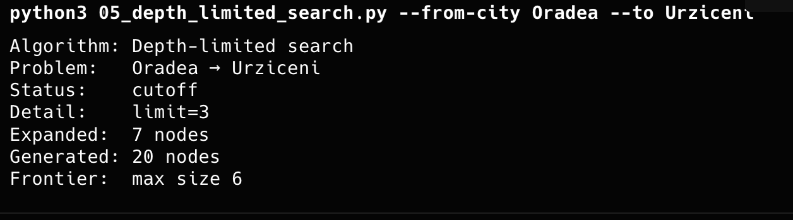
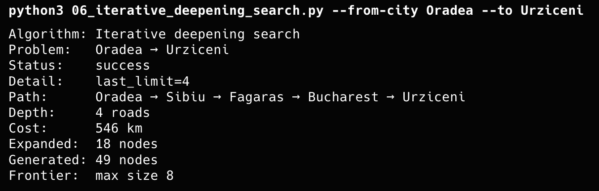

# Tabla comparativa

## Pareja: Oradea - Urziceni
## Subgrafo

|Código| Path | Depth | Cost | Expanded | Status |
|-------|------|-----------|-----------|-----------|--------|
| Breadth First Search   |  Oradea → Sibiu → Fagaras → Bucharest → Urziceni  | 4 roads | 546 km | 8 nodes   |  |
| Uniform Cost Search   | Oradea → Sibiu → Rimnicu Vilcea → Pitesti → Bucharest → Urziceni | 5 roads | 514 km | 13 nodes |  |
| Depth First Search   | Oradea → Sibiu → Arad → Timisoara → Lugoj → Mehadia → Drobeta → Craiova → Pitesti → Bucharest → Urziceni | 10 roads | 1109 km | 11 nodes |  |
| Depth Limited Search | | | | 7 nodes | cutoff|
| Iterative Deepening Search   | Oradea → Sibiu → Fagaras → Bucharest → Urziceni | 4 roads  | 546 km | 18 nodes |   |

### ¿BFS encontró el camino con menos carreteras? ¿UCS el de menos km?
<body> En efecto breadth-first search encontró el camino con menos carreteras, mientras que uniform-cost search encontró el de menos km., sin embargo expandio más nodos</body>

### ¿Por qué DFS puede devolver un camino más largo aunque el grafo sea el mismo?
<body> Porque DFS explora un camino hasta su límite antes de retroceder, lo que puede llevar a encontrar un camino más largo que el óptimo.</body>

### ¿Con qué --limit DLS pasó de cutoff a solución, y cómo se relaciona eso con la profundidad del camino de BFS/IDS?
<body> El limite DLS fue 4, lo que se relaciona con la profundidad del camino encontrado por BFS, sin embargo IDS encontro un camino mejor.</body>

### Evidencias
#### Breadth First Search

####  Uniform Cost Search

#### Depth First Search

#### Depth Limited Search

#### Iterative Deepening Search
