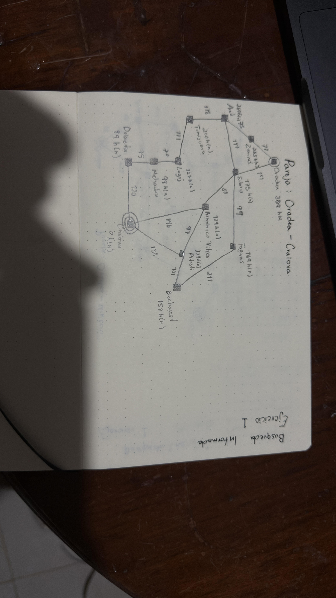
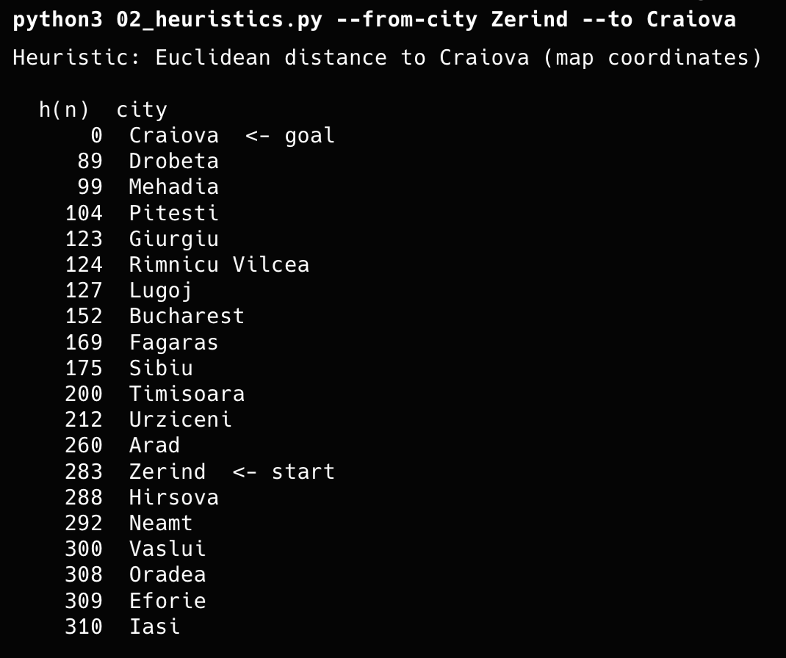
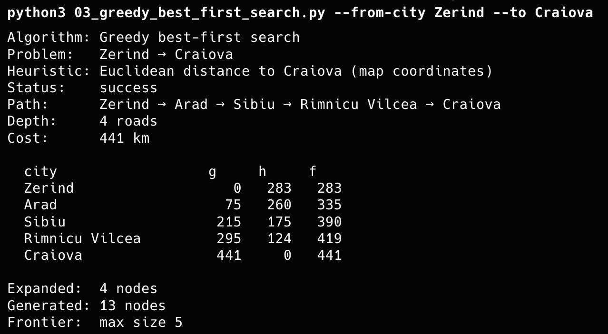
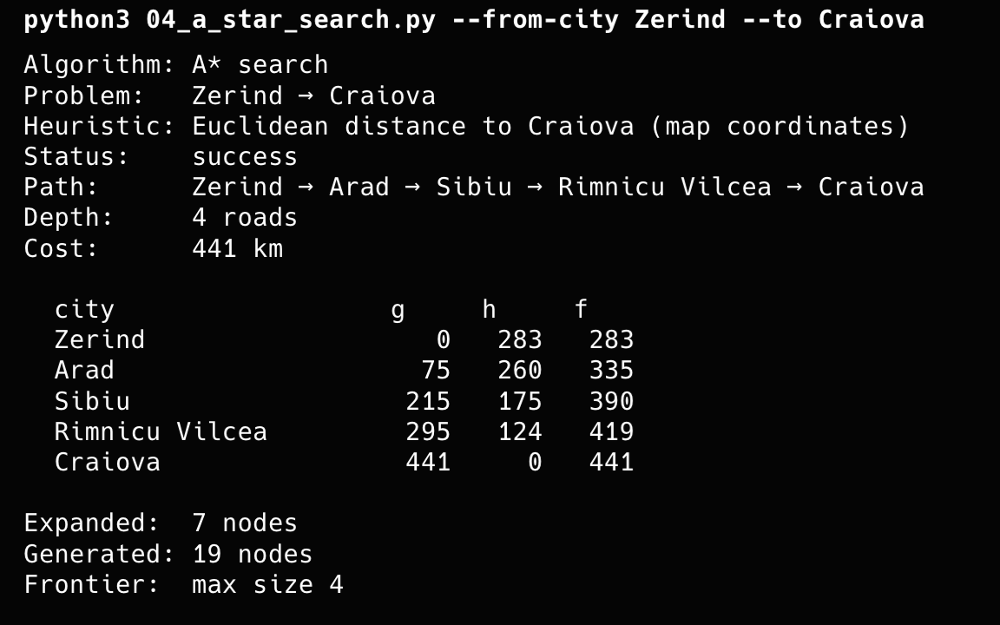

# Tabla comparativa

## Pareja: Zerind - Craiova

## Subgrafo

|Código| Path | Depth | Cost | Expanded | Generated | Heuristic |
|-------|------|-----------|-----------|-----------|--------|-------|
| Greedy Search   |  Zerind → Arad → Sibiu → Rimnicu Vilcea → Craiova| 4 roads | 441 km | 4 nodes   | 13 nodes | Distancia Euclideana |
| A* Search   | Zerind → Arad → Sibiu → Rimnicu Vilcea → Craiova | 4 roads | 441 km | 7 nodes | 19 nodes | Distancia Euclideana |

<body> Como podemos ver ambos algoritmos encontraron el mismo camino para poder llegar de Zerind a Craiova, Greedy puede devolver un camino más caro o suboptimo ya que toma decisiones basadas solo en el valor heurístico, sin considerar el costo real del camino recorrido. Mientras que A* evalúa el costo total del camino, incluyendo el costo real y el valor heurístico, lo que permite encontrar una solución óptima. En mi caso en especifico F tiende a aumentar en todos los nodos que toma. Cabe recalcar que al principio habia escogido como ciudad inicial Oradea, por lo que en mi dibujo se puede ver el subgrafo que dibuje pensando en esto, ya después escogí Zerind como ciudad inicial para ver si habia algun cambio en las decisiones tomadas por los algoritmos, pero al analizar crea el mismo Path para ambos casos de ciudad inicial escogida.</body>

### Heuristic 

### Greedy Search 

### A* Search

