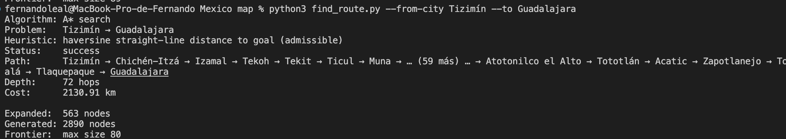
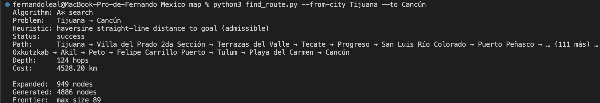

# Reporte — A* sobre el grafo de México

## ¿Qué usé como estado y cómo resolví los duplicados?

Como estado usé el **id** de cada ciudad, no el nombre. Cada ciudad del JSON tiene
un `id` único (del 0 al 999), mientras que los nombres se repiten unas 39 veces
(Puebla, Guadalupe, San Pedro...). Si usara el nombre, dos ciudades distintas
quedarían "mezcladas" y el grafo se rompería.

Entonces, cuando el usuario escribe un nombre en el CLI (o en el mapa), lo
normalizo (quito acentos y mayúsculas), busco las coincidencias y:

- si hay una sola, la uso directamente;
- si hay varias, elijo la **más poblada** y **aviso** por consola cuáles eran las
  otras (nombre, estado, id y población), para que nadie quede elegido al azar en
  silencio. También dejé `--from-id` / `--to-id` por si alguien quiere una ciudad
  específica.

## ¿Por qué haversine es admisible aquí?

Mi heurística es la distancia en línea recta (haversine) desde la ciudad actual
hasta el destino. Es admisible porque la línea recta entre dos puntos es lo más
corto que puede haber sobre la esfera: ningún recorrido real por las aristas puede
ser más corto que esa línea recta (es la desigualdad triangular). Y como cada
arista del grafo también es una distancia haversine, `h` nunca exagera el costo
real, siempre queda por debajo del óptimo. Por eso A* garantiza la ruta de menor
costo.

(Solo queda un matiz de decimales: las aristas están redondeadas a 2 decimales,
así que a veces `h` se pasa por menos de 0.005 km; es irrelevante.)

## Ruta larga: 
### Tizimín -> Guadalajara
- Costo: **2130.91 km**
- Hops: **72**
- Nodos expandidos por A*: **563**

### Tijuana -> Cancún
- Costo: **4528.2 km**
- Hops: **125**
- Nodos expandidos por A*: **949**

## Evidencias

### Tizimín -> Guadalajara

### Tijuana -> Cancún
