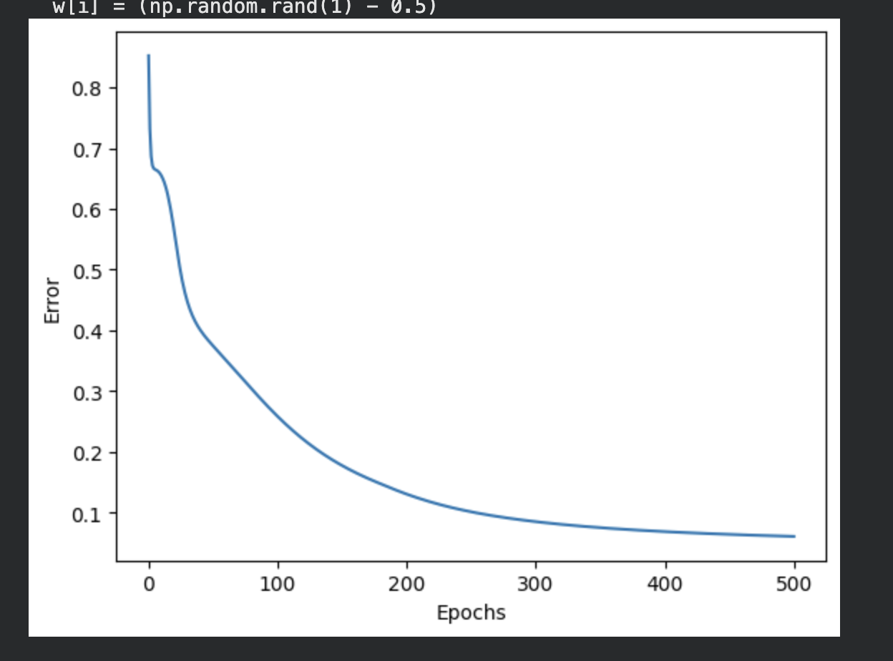
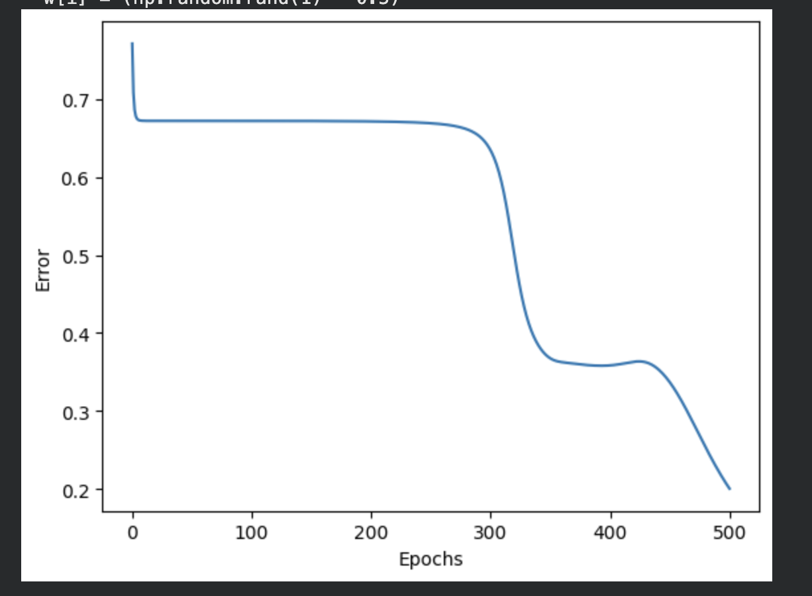
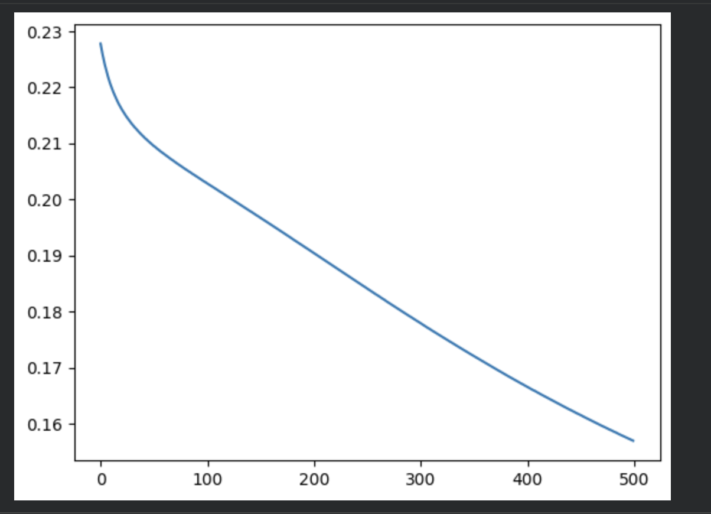
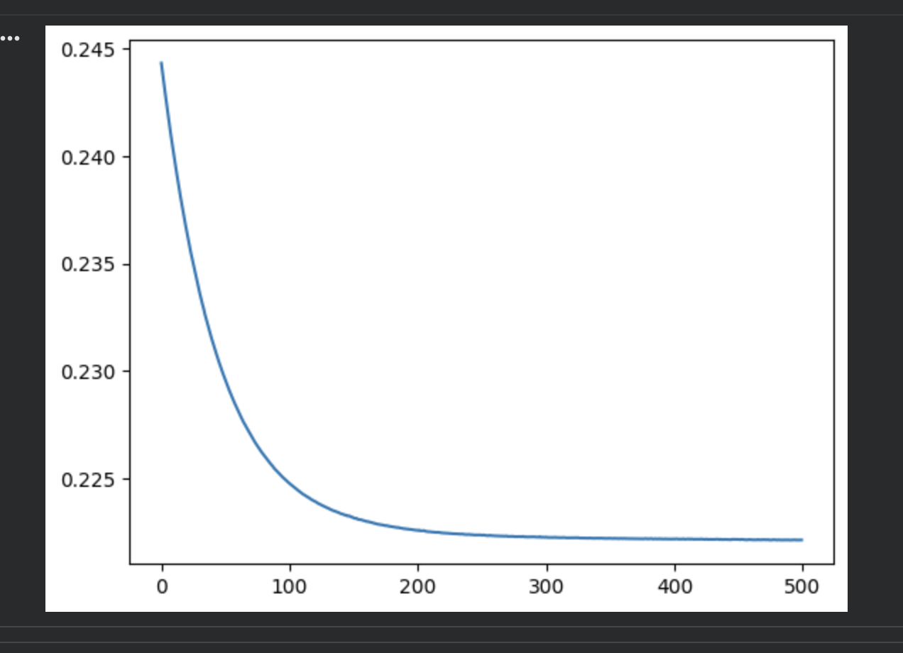
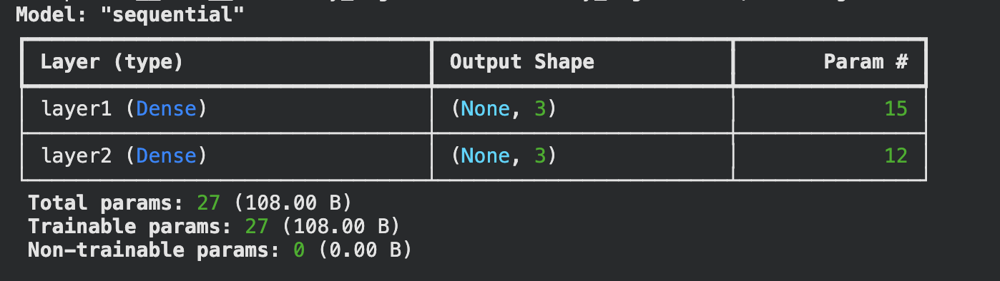
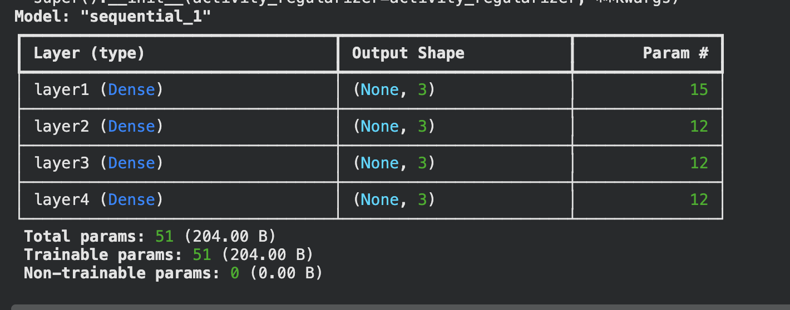
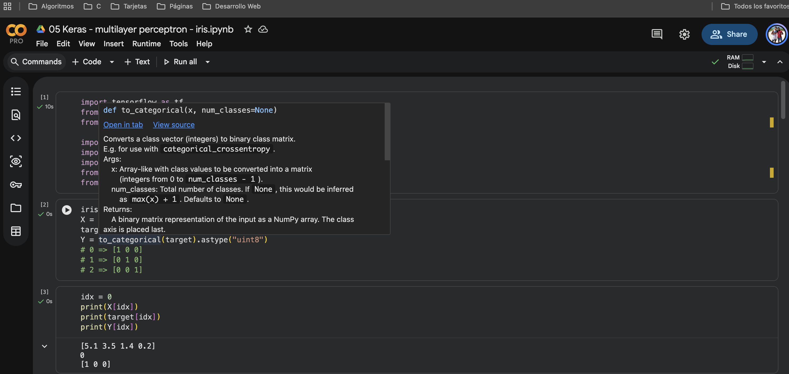
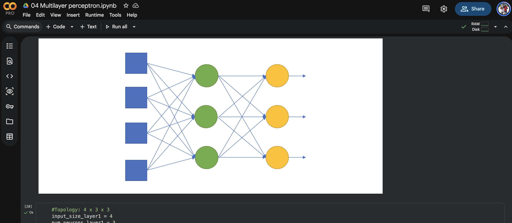

# Reporte Perceptrón Multicapa

## ¿Bajar más el error al añadir dos capas, o se estancó / empeoró? ¿Igual en NumPy y en Keras?

<body> En ambos casos, se estancó o empeoró al añadir las dos capas, se determinó que la profundidad no mejora el rendimiento; por el contrario, estanca la convergencia, en NumPy el modelo profundo presenta una fuerte dependencia de la semilla de inicialización, mientras que en Keras el error cae de 0.25 a 0.22 y se estabiliza. Este valor corresponde exactamente al MSE de una solución trivial, la cual consiste en predecir siempre una probabilidad uniforme para las tres clases: [1/3,1/3,1/3]. Por lo que para este problema, añadir más capas no aporta ventaja representacional; en el mejor escenario iguala a la red original invirtiendo mucho más tiempo, y en el peor, colapsa en la linea trivial.</body>

## ¿Las curvas de la notebook 01 y de Keras se parecen con la misma topología? Si no, ¿qué diferencias de implementación podrían explicarlo (orden de los datos, inicialización, vectorización, etc.)?

<body> Numpy calcula el MSE dividiendo unicamente por el número de muestras, mientras que Keras divide por n * 3. Por esto, la misma solución trivial matemáticamente produce MSE = 0.6667 en Numpy y MSE = 0.2222 en Keras. Tambien esta la inicialización ya que numpy utiliza una distribucion uniforme U(-0.5, 0.5). Keras utiliza la inicialización Glorot Uniform, que genera pesos de mayor magnitud. Estos pesos más grandes provocan una mayor saturación prematura de las funciones de activación, lo que agrava el desvanecimiento del gradiente y hace que Keras se estanque de forma más consistente.</body>

## Con sigmoides apiladas y MSE, ¿tiene sentido que una red más profunda no aprenda mejor en Iris? Relaciónalo con lo que viste en las gráficas.

<body> Si es justo lo que muestran las gráficas, la derivada de la sigmoide vale ≤ 0.25 y tiende a 0 en saturación. Al apilar 4 sigmoides, el gradiente que llega a las primeras capas es un producto de varios factores < 0.25 -> prácticamente no actualiza nada. Iris es casi linealmente separable en 4 dimensiones: una capa oculta alcanza, así que la profundidad extra solo añade dificultad de optimización, no capacidad útil. 
Con sigmoides apiladas + MSE, una red más profunda en Iris no aprende mejor porque el gradiente se desvanece y la red se conforma con la solución trivial; la red original llega igual o mejor, y mucho antes.</body>

## Curvas de Error

### Multilayer Notebook 01 Red Original

### Multilayer Notebook 01 Red Profunda

### Multilayer Keras Red Original

### Multilayer Keras Red Profunda

### Model Summary Keras Red Original

### Model Summary Keras Red Profunda

## Enlaces

https://colab.research.google.com/drive/1fAyBNE5Wm-H7mWpXudNf7Bktq5zCRC8w?usp=sharing

https://colab.research.google.com/drive/1lusgAjXaNEX7048dIh3jdbXnAhPtmBKu?usp=sharing

## Evidencias

