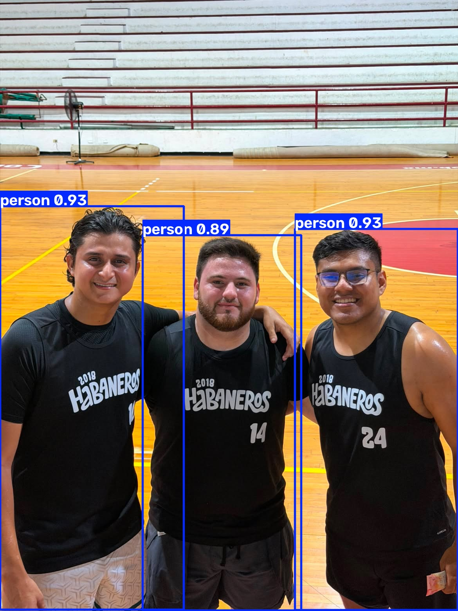
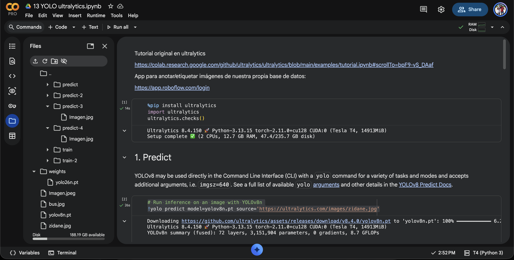

# Vision Computacional: Ejercicio 1

## ¿Qué clases detectó YOLO en las fotos de Ultralytics y cuáles en la tuya?
Yolo detectó las siguientes clases en las fotos de Ultralytics:
- Zidane.jpg: Person, tie.
- bus.jpg: Bus, Person y Stop sign.
 

En mi foto YOLO detectó las siguientes clases:
- Imagen.jpg: Person

## ¿Algún objeto evidente de tu foto no salió etiquetado? ¿Por qué podría pasar (clase que no está en COCO, objeto chico, recorte, umbral de confianza)?
Afortunadamente mi imagen, que es una foto normal entre amigos, no tiene ningún objeto evidente que no haya sido etiquetado. Sin embargo, si hubiera algún objeto que no se detectara, podría ser por varias razones: la clase del objeto no está incluida en el conjunto de datos COCO, el objeto es demasiado pequeño para ser detectado, la imagen está recortada de manera que el objeto no es visible, o el umbral de confianza del modelo es demasiado alto para detectar ciertos objetos.
## ¿La predicción de la celda CLI y la de model(...) coinciden sobre tu misma imagen?
En este caso coinciden pero a la vez no, logro detectar la clase persona en ambos casos, pero la celda CLI tuvo mayor precision en la detección de la persona, mientras que la predicción de model(...) tuvo un menor nivel de confianza en la detección de la misma clase. Esto puede deberse a diferencias en los parámetros utilizados en cada método o a variaciones en el procesamiento de la imagen.

## Capturas

### Zidane.jpg

### bus.jpg

### Mi foto celda CLI

### Mi foto model(...)

## Evidencia Colab

## Enlaces
https://colab.research.google.com/drive/1drBMJRwrCsKs8b-q_LkQaripS-gqbhwR?usp=sharing

