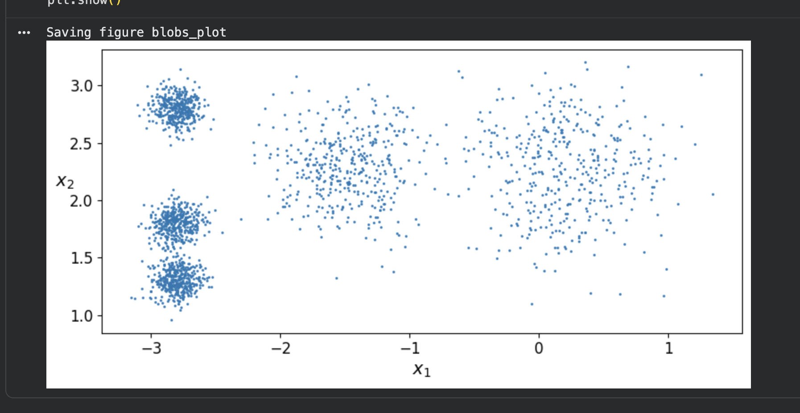
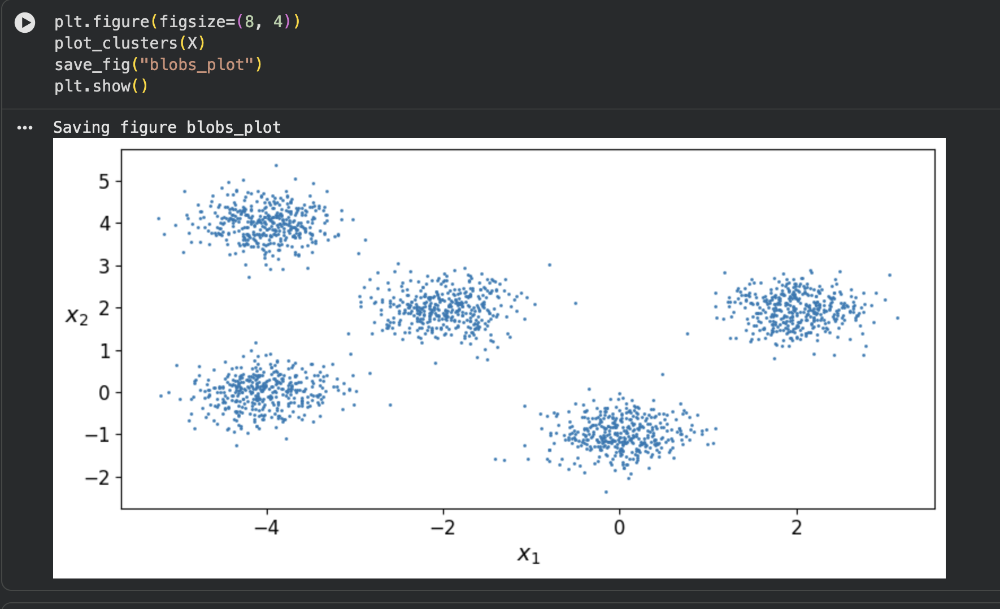
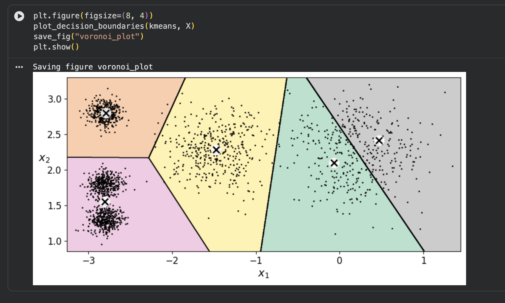
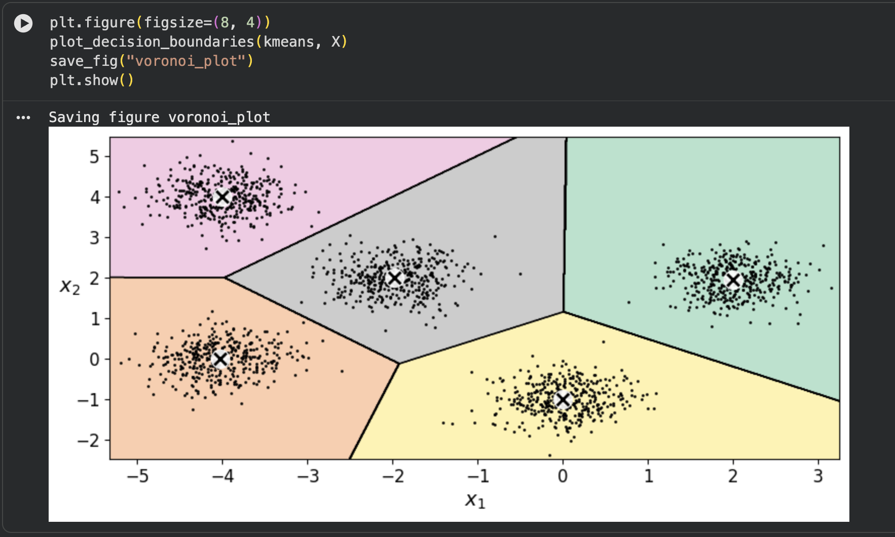
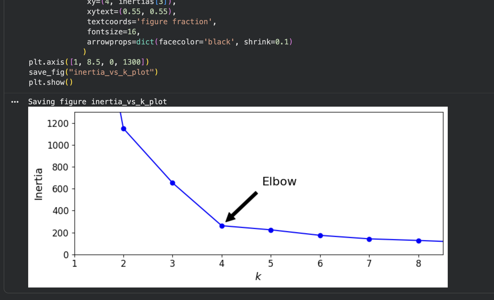
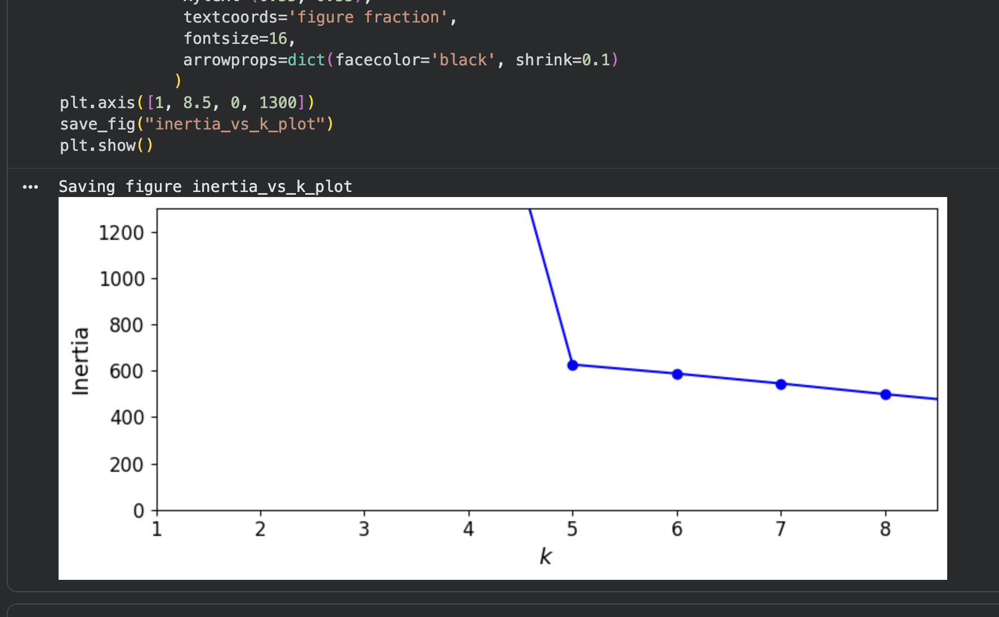
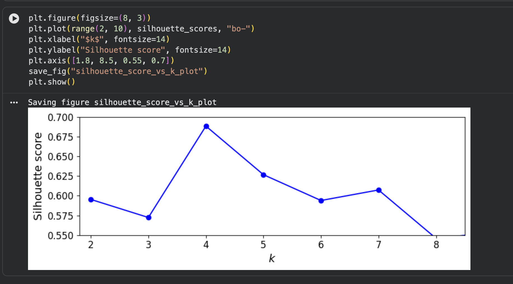
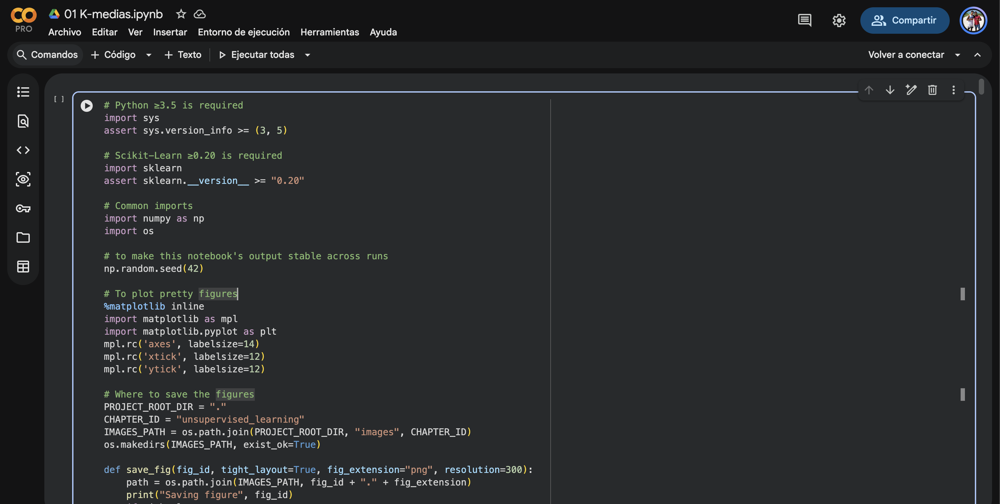

# Reporte — K-Means: codo y silueta

## Datos usados (blobs)

`make_blobs` con **2000 puntos** y estos **5 centros / 5 std**:

```python
blob_centers = np.array(
    [[ 2.0,  2.0],
     [-2.0,  2.0],
     [-4.0,  0.0],
     [-4.0,  4.0],
     [ 0.0, -1.0]])
blob_std = np.array([0.4, 0.4, 0.4, 0.4, 0.4])
```

## 1. ¿Por qué Géron da el codo en k=4 si make_blobs usó 5 centros?

El codo no "cuenta" los centros reales, mide la **ganancia marginal de inercia**
al ir subiendo k. En los datos de Géron los centros están muy pegados: la
separación mínima entre centros es **0.5** (los tres de la izquierda, en x=-2.8,
quedan a 0.5–1.5 unidades). Por eso, al pasar de k=4 a k=5 la inercia casi no
baja (261.80 → 219.43), mientras que de 3→4 bajó mucho (653.22 → 261.80). La
curva se "aplana" antes de llegar a 5 y el codo aparece en 4: las nubes
traslapadas hacen que un quinto cluster no aporte casi nada.

## 2. Con mis blobs separados, ¿coinciden codo y silueta? ¿Ese k es 5?

Sí, ambos caen en **k=5**:

- **Inercia**: cae fuerte de 4→5 (2247.62 → 626.12) y después casi se estanca
  (5→6: 626.12 → 578.95). Codo en 5.
- **Silueta**: llega a su máximo en k=5 (**0.7654**) y ya baja en k=6 (0.6775).

## 3. Si el codo siguiera en 4, ¿qué me falta mover?

Hay que aumentar la **separación entre centros respecto al `blob_std`**: o alejar
más los centros, o achicar `blob_std` para que las nubes no se traslapen. La
regla práctica es que la distancia entre centros sea varias veces el `std`; en mi
caso la mínima es 2.83 con `std` 0.4 (~7×), y por eso el codo subió a 5. Si dos
nubes quedan a menos de ~3·std, K-Means no las separa bien y el codo se queda
corto (en 4).

## Inercia, codo y silueta (números)

**Inercia de Géron** (celdas `kmeans_k3.inertia_`, `kmeans.inertia_`, `kmeans_k8.inertia_`):

- k=3 → **653.22**
- k=5 → **224.07**
- k=8 → **127.13**

**Codo**: lo marcaría en **k=4** para los datos de Géron; con mis blobs separados sube a **k=5**.

**Silueta máxima**: en **k=4** para Géron (**0.6885**); con mis blobs, en **k=5** (**0.7654**).

## Scatter original


## Scatter modificado


## Voronoi original


## Voronoi modificado


## Codo original


## Codo modificado


## Silueta original


## Silueta modificado


## Enlace al colab
https://colab.research.google.com/drive/1ubO_9MLRZC6wA24TA6I5fnSE8PVkOY_o?usp=sharing

## Evidencia del colab
