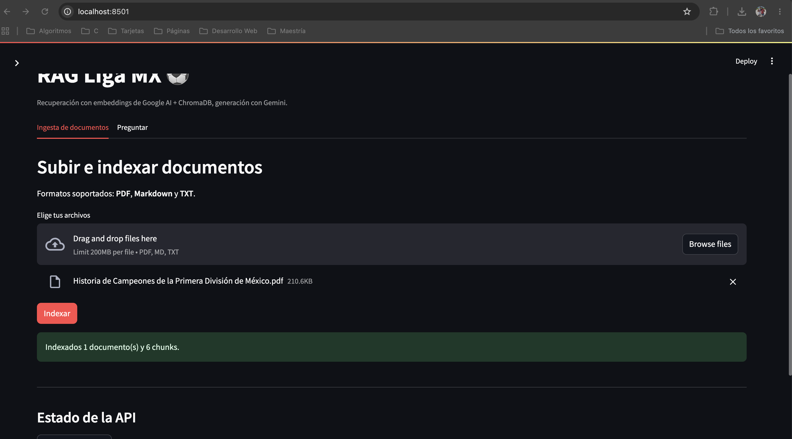
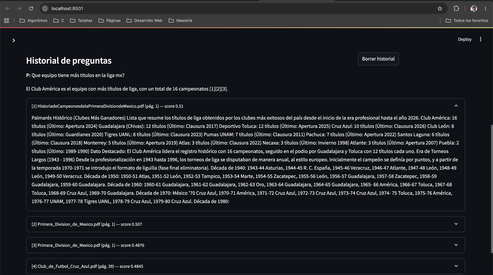
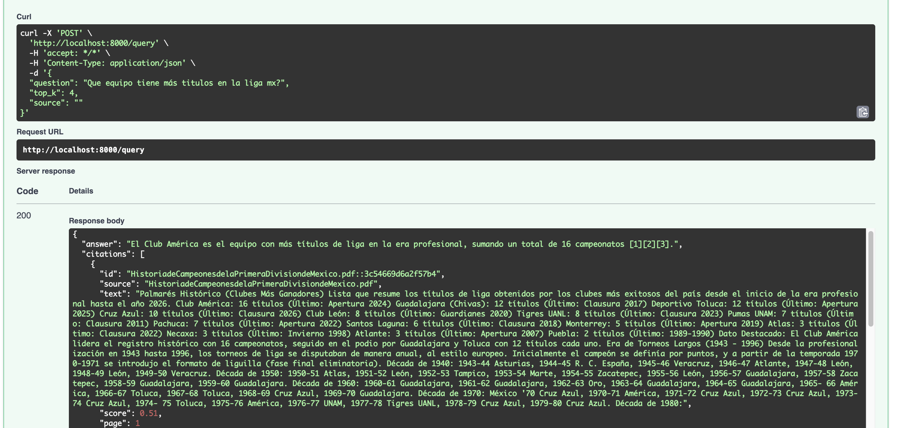
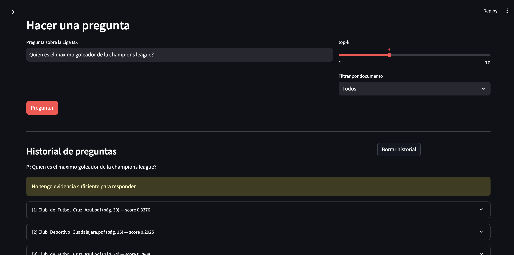

# Reporte — Sistema RAG de la Liga MX

**Stack:** Streamlit → FastAPI → ChromaDB → Google AI (embeddings + Gemini)

## 1. Dominio y corpus

Dominio: **estadísticas e historia de la Liga MX** (fútbol mexicano). El corpus
son 7 PDFs con texto seleccionable (Wikipedia, reescalados), con fecha de corte
a 2026, sumando ~158 600 palabras. Tras particionar, el índice contiene **789
chunks**.

| Documento | Chunks |
|---|---|
| Club_America.pdf | 230 |
| 75.pdf | 164 |
| Club_de_Futbol_Cruz_Azul.pdf | 119 |
| Club_Universidad_Nacional.pdf | 110 |
| Primera_Division_de_Mexico.pdf | 82 |
| Club_Deportivo_Guadalajara.pdf | 78 |
| HistoriadeCampeonesdelaPrimeraDivisiondeMexico.pdf | 6 |

Modelo de embeddings: **`gemini-embedding-2`** (vectores de 3072 dimensiones).
El mismo modelo incrusta documentos y preguntas (condición obligatoria: si se
mezclan modelos, el k-NN pierde sentido).

## 2. Partición (chunking)

`CHUNK_SIZE = 300` palabras y `CHUNK_OVERLAP = 60` palabras (20% de solape).
Motivos:

- **300 palabras** es suficiente para que un chunk contenga un dato completo
  (ej. un palmarés o un récord) sin ser tan largo que diluya la similitud.
- El **overlap de 60** evita que un dato que cae justo en el borde entre dos
  chunks se pierda: la información crítica queda al menos en un chunk íntegro.
- **No se mezclan páginas**: cada chunk pertenece a una sola página, de modo
  que la cita `[n]` apunta a una ubicación precisa (`source` + `page`).

## 3. Criterio de abstención

Se combinan dos mecanismos:

1. **Umbral de score** (`MIN_SCORE = 0.35`). El score es la similitud coseno
   (`1 − distancia` de ChromaDB). Si ningún chunk recuperado supera 0.35, la
   API responde directamente *"No tengo evidencia suficiente"* sin invocar a
   Gemini. En la práctica, las preguntas de dominio puntúan 0.40–0.55 y las
   fuera de dominio quedan en ≤0.25.
2. **Instrucción al modelo.** El prompt numera los chunks `[1]…[k]` y exige a
   Gemini responder solo con esa evidencia; si el dato no aparece, debe
   abstenerse. Si la respuesta contiene el marcador de abstención, el campo
   `abstained` se marca `true`.

Resultado verificado: ante *"¿Quién ganó la Champions 2024?"* el sistema
responde *"No tengo evidencia suficiente"* y no alucina.

## 4. División de responsabilidades

| Componente | Qué produce | Qué hace |
|---|---|---|
| **Google AI — embeddings** (`gemini-embedding-2`) | Un vector de 3072 floats por texto | Convierte cada chunk y cada pregunta en un punto del espacio vectorial |
| **Google AI — generación** (`gemini-3.8-flash`) | Texto en español con citas `[n]` | Redacta la respuesta **solo** a partir de los chunks recuperados |
| **ChromaDB** | Persistencia y k-NN | Guarda chunks + vectores + metadatos en disco (`chroma/`) y devuelve los `top-k` más similares a la pregunta |

El flujo es estrictamente *recuperar primero, generar después*: FastAPI incrusta
la pregunta, Chroma devuelve los `top-k` chunks, y solo entonces Gemini redacta
la respuesta anclada a esa evidencia.

## 5. Validación

- **3 preguntas de dominio** → respuesta en español con citas `[n]` trazables a
  chunks visibles en la UI (p. ej. *"El América tiene 16 títulos [1][2]"*).
- **1 pregunta fuera de dominio** → `abstained = true`.
- **Persistencia**: reiniciar FastAPI conserva el índice (789 chunks en
  `chroma/`).
- `/docs` expone `/health`, `/ingest`, `/query` y `/sources`.

## 6. Evidencia

### 6.1 Indexación de un documento desde la UI

Pestaña **Ingesta** de Streamlit: se sube un PDF y la API responde
*"Indexados 1 documento(s) y 6 chunks."*

### 6.2 Respuesta con citas y scores en Streamlit

Pregunta *"¿Qué equipo tiene más títulos de la Liga MX?"*: respuesta
*"El Club América es el equipo con más títulos de liga, con un total de 16
campeonatos [1][2][3]."* y, debajo, los chunks recuperados con `source`, `page`
y `score` (0.51, 0.507, 0.4876, 0.4845).

### 6.3 La misma pregunta contra la API (`/docs` / curl)

`POST /query` en Swagger con la misma pregunta: respuesta JSON con `answer`,
`citations` (cada una con `source`, `text`, `score`, `page`) y
`abstained: false`.

### 6.4 Pregunta fuera de dominio (abstención)

Pregunta fuera de dominio: el sistema responde *"No tengo evidencia suficiente
para responder."* con `abstained: true` y scores por debajo del umbral
(0.34, 0.29, …), sin alucinar.
